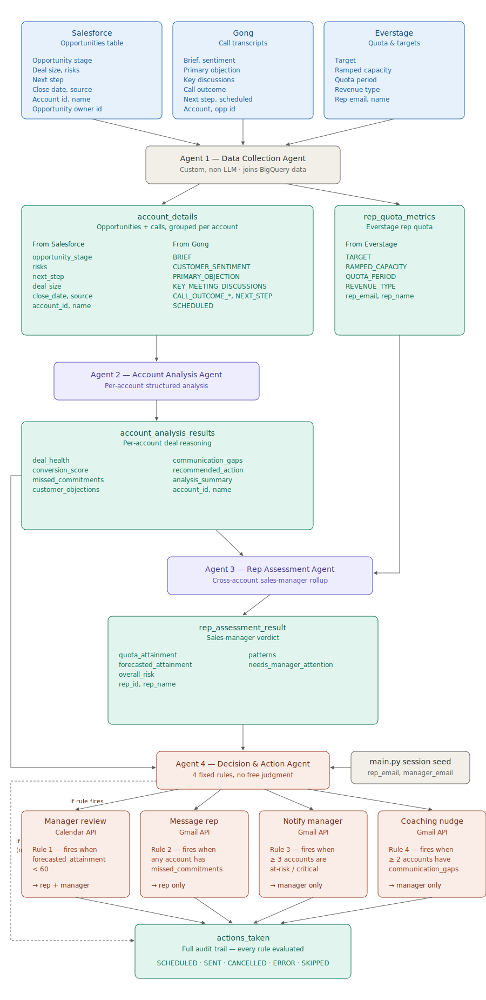

# Sales Conversion Agent — Pipeline Documentation

End-to-end reference for the `sales_rep_pipeline` sequential ADK pipeline defined in [`scripts/SequentialAgent.py`](scripts/SequentialAgent.py). Covers the four sub-agents, the source data each one consumes, and the actions triggered at the end.

## Pipeline overview

The pipeline runs four sub-agents in order via `google.adk.agents.SequentialAgent`. Each agent reads from and writes to the shared session state; nothing runs in parallel and there is no human-confirmation gate in the current build.

| # | Agent | Type | Reads (session state) | Writes (session state) |
|---|-------|------|------------------------|--------------------------|
| 1 | `DataCollectionAgent` | Custom (non-LLM) | `sales_rep_id` | `account_details`, `rep_quota_metrics` |
| 2 | `account_analysis_agent` | LlmAgent (`gemini-2.5-flash-lite`) | `account_details` | `account_analysis_results` |
| 3 | `rep_assessment_agent` | LlmAgent (`gemini-2.5-flash`) | `rep_quota_metrics`, `account_analysis_results` | `rep_assessment_result` |
| 4 | `decision_action_agent` | LlmAgent (`gemini-2.5-flash`) | `rep_assessment_result`, `account_analysis_results`, `rep_email`, `manager_email` | `actions_taken` |

All three LLM agents are configured with `include_contents='none'`, so each Gemini call sends only the current instruction + input — no prior turns of chat history — cutting token size and latency.

Session state is seeded in [`main.py`](main.py) with `sales_rep_id`, `rep_email`, and `manager_email`. `main.py` also times the run end-to-end and per agent (`⏱ Total pipeline time`, `⏱ Per-agent duration`) so latency regressions are visible on every run.

## Flow diagram

The full pipeline — sources, joined session state, LLM reasoning agents, decision rules, and real-system actions — in a single figure. Every box shows the actual fields it holds or reads.



Colour key: **blue** = raw external source, **gray** = non-LLM step or seed, **teal** = session-state object, **purple** = LLM reasoning agent, **coral** = decision agent and its real-world outputs.

---

## Source systems

Three BigQuery tables in `atgeir-moae-dev.Agentic_AI_Demo` are the ground truth for every downstream reasoning step. The full column pulls happen once, in Agent 1.

### Salesforce — `Salesforce_Sales_Recipe_Data`
Filtered by `Opportunity Owner ID = sales_rep_id`.

- `Opportunity ID`, `Opportunity Name`
- `Account ID`, `Account Name`
- `Opportunity Stage`
- `Opportunity Close Date`
- `Opportunity Risks`
- `Opportunity Next Step`
- `Opportunity Deal Size`
- `Opportunity Type`
- `Opportunity Source`
- `Sales Rep Name`
- `Opportunity Owner ID`

### Gong — `Gong_Calls_Data`
Filtered by `PRIMARY_USER_ID = sales_rep_id`, ordered by `SCHEDULED DESC`.

- `ID`, `CUSTOM_DATA`, `TITLE`, `PURPOSE`, `SCHEDULED`
- `COMPANY_QUESTION_COUNT`
- `BRIEF`
- `CALL_OUTCOME_CATEGORY`, `CALL_OUTCOME_NAME`
- `MEETING_STAGE_CONTEXT`
- `CUSTOMER_SENTIMENT`
- `PRIMARY_OBJECTION`
- `NEXT_STEP`
- `KEY_MEETING_DISCUSSIONS`
- `ACCOUNT_ID`, `ACCOUNT_NAME`, `OPPORTUNITY_ID`

### Everstage — `Everstage_Data`
Joined via `REP_EMAIL = (SELECT SALES_REP_EMAIL FROM Gong WHERE PRIMARY_USER_ID = sales_rep_id)`.

- `REVENUE_TYPE`
- `REP_EMAIL`, `REP_NAME`
- `RAMPED_CAPACITY`
- `TARGET`
- `QUOTA_PERIOD`

---

## Agent 1 — Data Collection Agent

File: [`scripts/data_collection_custom_agent/agent.py`](scripts/data_collection_custom_agent/agent.py)

Custom non-LLM agent. Runs three BigQuery queries in parallel, joins the results, and drops two objects into session state.

### Reads
- `sales_rep_id` (from session state)

### Writes

**`account_details`** — list, one entry per account. Every Salesforce opportunity row plus every matching Gong call for that account:
```
[
  {
    account_id, account_name,
    opportunities: [ …all Salesforce columns… ],
    calls:         [ …all fetched Gong columns… ]
  },
  …
]
```

**`rep_quota_metrics`** — one object for the rep:
```
{
  sales_rep_id, rep_name, rep_email,
  quota_data: [ { REVENUE_TYPE, REP_EMAIL, REP_NAME,
                  RAMPED_CAPACITY, TARGET, QUOTA_PERIOD } ]
}
```

Salesforce and Gong columns fan out to `account_details`; Everstage columns fan out to `rep_quota_metrics`. Nothing else touches Everstage after this step.

---

## Agent 2 — Account Analysis Agent

Files: [`scripts/account_analysis_agent/agent.py`](scripts/account_analysis_agent/agent.py), [`prompt.py`](scripts/account_analysis_agent/prompt.py), [`output_schema.py`](scripts/account_analysis_agent/output_schema.py)

Model: `gemini-2.5-flash-lite`. Analyzes every account in a single call using structured Pydantic output.

### Reads (from `account_details`)

Salesforce-side fields:
- `opportunity_stage` — baseline for conversion score
- `risks` — pre-flagged deal risks
- `next_step` — the rep's planned action
- `deal_size` — Small / Medium / Large

Gong-side fields:
- `BRIEF` — call summary
- `CUSTOMER_SENTIMENT` — Positive / Neutral / Negative
- `PRIMARY_OBJECTION` — main customer objection
- `KEY_MEETING_DISCUSSIONS` — pain, process, objection, next step breakdown
- `CALL_OUTCOME_NAME`, `CALL_OUTCOME_CATEGORY`
- `NEXT_STEP` — agreed post-call next step
- `SCHEDULED` — call date, used to order calls chronologically

### Writes: `account_analysis_results`

One `AccountAnalysisResult` per account:
- `account_id`, `account_name`
- `deal_health` — `healthy` | `at_risk` | `critical` | `stalled`
- `conversion_score` — 0–100
- `missed_commitments` — list of `{description, call_date, status}`
- `customer_objections` — list of `{objection, severity}`
- `communication_gaps` — topics customer raised, never addressed
- `recommended_action` — single most important next step
- `analysis_summary` — 2–3 sentence manager brief

### Reasoning rules (from the prompt)
1. **Missed commitments** — chronologically compare `NEXT_STEP` across calls. Any earlier next step not reflected as completed later is missed.
2. **Customer objections** — group repeats of `PRIMARY_OBJECTION` and `KEY_MEETING_DISCUSSIONS` across calls; frequency drives severity.
3. **Communication gaps** — customer questions in `KEY_MEETING_DISCUSSIONS` not answered in a later `BRIEF`.
4. **Deal health** — `opportunity_stage` + sentiment trend + objection pattern.
5. **Conversion score** — stage baseline (`Closed Won=95`, `Procurement=80`, `Evaluation=65`, `Proposal=50`, `Demo=40`, `Discovery=25`), then ±adjustments for objections, missed commitments, sentiment.

---

## Agent 3 — Rep Assessment Agent

Files: [`scripts/rep_assessment_agent/agent.py`](scripts/rep_assessment_agent/agent.py), [`prompt.py`](scripts/rep_assessment_agent/prompt.py), [`output_schema.py`](scripts/rep_assessment_agent/output_schema.py)

Model: `gemini-2.5-flash`. Effectively the sales-manager step: cross-account reasoning only, no re-reading of raw data.

### Reads

From `rep_quota_metrics` (originally Everstage):
- `TARGET`
- `RAMPED_CAPACITY`
- `QUOTA_PERIOD`
- `REVENUE_TYPE`
- `sales_rep_id`, `rep_name`

From `account_analysis_results` (Agent 2 output):
- `deal_health`
- `conversion_score`
- `missed_commitments`
- `customer_objections`
- `communication_gaps`

### Writes: `rep_assessment_result`

- `rep_id`, `rep_name`
- `quota_attainment` — `(avg RAMPED_CAPACITY / avg TARGET) * 100`, rounded
- `forecasted_attainment` — quota attainment adjusted by health/score of open accounts
- `overall_risk` — `Low` | `Medium` | `High`
- `patterns` — recurring issues appearing in 2+ accounts
- `needs_manager_attention` — `True` if `High` risk, or ≥3 at-risk/critical/stalled accounts, or forecast < 60

### Reasoning rules
1. Is the rep likely to hit quota? Compute `quota_attainment` from Everstage; project `forecasted_attainment` using open accounts only (exclude Closed Won / Closed Lost).
2. Are too many deals at risk? Count accounts where `deal_health ∈ {at_risk, critical, stalled}`. ≥3 = significant signal.
3. Pattern of missed follow-ups? Cross-account groupings of `missed_commitments` / `communication_gaps`. Only counts if seen in 2+ accounts.
4. Coaching required? Roll #1–3 into `overall_risk` and `needs_manager_attention`.

---

## Agent 4 — Decision & Action Agent

Files: [`scripts/decision_action_agent/agent.py`](scripts/decision_action_agent/agent.py), [`prompt.py`](scripts/decision_action_agent/prompt.py), [`tools.py`](scripts/decision_action_agent/tools.py), [`output_schema.py`](scripts/decision_action_agent/output_schema.py)

Model: `gemini-2.5-flash`. Rule-based, not free judgment. The LLM's job is to read the structured fields, apply fixed thresholds, and call the right tool with grounded arguments.

### Reads

From `rep_assessment_result`:
- `forecasted_attainment`
- `overall_risk`
- `patterns`
- `rep_id`, `rep_name`

From `account_analysis_results`:
- `deal_health`
- `missed_commitments`
- `communication_gaps`
- `account_id`, `account_name`

From session state (seeded in `main.py`):
- `rep_email`
- `manager_email`
- `sales_rep_id`

Never touches raw Salesforce / Gong / Everstage columns.

### Decision rules

| # | Rule | Condition | Tool | Recipient |
|---|------|-----------|------|-----------|
| 1 | Quota risk | `forecasted_attainment < 60` | `schedule_review_meeting` (Calendar API) | rep + manager |
| 2 | Missed commitments | Any account with ≥1 `missed_commitments` entry | `message_rep` (Gmail API) | rep |
| 3 | Multiple at-risk deals | ≥3 accounts with `deal_health ∈ {at_risk, critical, stalled}` | `notify_manager` (Gmail API) | manager |
| 4 | Communication quality | ≥2 accounts with non-empty `communication_gaps` | `recommend_coaching` (Gmail API) | manager |

Tool calls happen one at a time in the order above and execute immediately — no human confirmation gate in the current pipeline. Each rule always produces one entry in `actions_taken`, including `SKIPPED` entries when the threshold isn't met, so the full decision trail is auditable.

**SKIPPED entries never invoke a tool.** The prompt now says explicitly: if a rule's threshold isn't met, add an entry with `status: "SKIPPED"` to the final JSON output *only* — do not call `schedule_review_meeting` / `message_rep` / `notify_manager` / `recommend_coaching`. Only the four listed tools are ever valid targets for a call. This is shown in the flow diagram as the dashed bypass arrow from Agent 4 straight to `actions_taken`.

### Writes: `actions_taken`

List of `ActionRecord` entries:
- `type` — `schedule_manager_review` | `message_rep` | `notify_manager` | `recommend_coaching`
- `status` — `SCHEDULED` | `SENT` | `CANCELLED` | `ERROR` | `SKIPPED`
- `rep_id`, `rep_name`
- `account_id` / `account_ids` (for account-batched actions)
- `reason` — grounded citation of the fields that fired the rule
- `detail` — event id, message id, scheduled time

### Meeting scheduling
`schedule_review_meeting` always sets the meeting at the next business day 10:00 AM `Asia/Kolkata`, 30 minutes, with a Google Meet link auto-created.

---

## Source-field lineage summary

| Source | Lands in | Consumed by |
|--------|----------|-------------|
| Salesforce columns | `account_details.opportunities` | Agent 2 only |
| Gong columns | `account_details.calls` | Agent 2 only |
| Everstage columns | `rep_quota_metrics.quota_data` | Agent 3 only |
| Agent 2 output | `account_analysis_results` | Agents 3 and 4 |
| Agent 3 output | `rep_assessment_result` | Agent 4 |
| `main.py` seed | `rep_email`, `manager_email`, `sales_rep_id` | Agent 4 |

Agents 3 and 4 never see raw source rows — only distilled state written by the preceding step.

---

## Business impact (from the design deck)

- 8% improvement in win rate
- 8% increase in deals won
- 8% growth in closed ARR
- 7% reduction in sales cycle length

---

## Notes / current gaps

- `scripts/rep_quota_analysis_agent/` exists in the repo but is **not wired into** [`SequentialAgent.py`](scripts/SequentialAgent.py). It appears to be an earlier alternate to `rep_assessment_agent` and is dead code in the current pipeline.
- No human confirmation gate: tools in Agent 4 execute immediately. If a manual approval step is reintroduced, it belongs before the Gmail/Calendar sends in [`tools.py`](scripts/decision_action_agent/tools.py).
- `rep_email` / `manager_email` are seeded manually in `main.py` today; the Agent 4 prompt notes this is pending a final source-of-truth decision.
